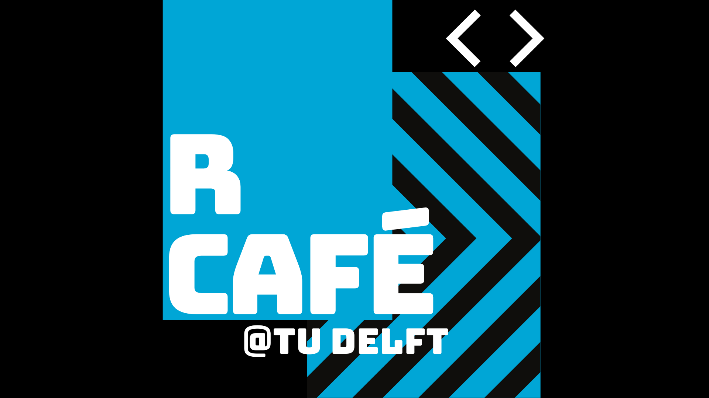

```{r setup, include=FALSE}
knitr::opts_chunk$set(echo = FALSE,
                      warning = FALSE,
                      message = FALSE
                    )
# Load libraries ----------------------------------------------------------
# Package names
packages <- c("tidyverse", "here", "data.table", "igraph", "ggraph", "stringr", "tm", "tidytext", "pluralize" , "quanteda", "fst", "stopwords", "SnowballC", "textstem" ,"wordcloud2", "viridis", "htmlwidgets", "webshot", "lexicon", "wesanderson", "RColorBrewer", "textdata", "stringi", "networkD3"
              )

# Install packages not yet installed
installed_packages <- packages %in% rownames(installed.packages())
if (any(installed_packages == FALSE)) {
  install.packages(packages[!installed_packages])
}

# Packages loading 
invisible(lapply(packages, library, character.only = TRUE))

# Themes and colors ----------------------------------------------------------

# Set the ggplot theme
theme_set(theme_minimal())

bg <- '#f7f7f7' #'background'  
edge<- 'gray60'
label <- 'gray40'

tud_blue<-'#00A6D6'

# Load data ----------------------------------------------------------
network <- readRDS(here('data', 'network.RDS'))
words_clean <- readRDS(here('data', 'words_clean.RDS'))
mycolors <- c( rep(tud_blue,6),rep('#000000',1000))

```

# Why R?

```{r word-cloud}
wcloud_data <- words_clean[order(-N_total)][1:1000]

set.seed(12345)
wordcloud2(wcloud_data, size = 0.7, color = mycolors)
```


```{r network}

# Create networkD3 object.
network_D3 <- igraph_to_networkD3(g = network)
# Define node size.
network_D3$nodes$size <- 100* V(network)$degree
# Degine color group (I will explore this feature later).
network_D3$nodes$group <- 1
# Define edges width. 
network_D3$links$value <- 20*E(network)$width


ColourScale <- 'd3.scaleOrdinal()
            .domain(["lions", "tigers"])
           .range(["#00A6D6", "#694489"]);'


forceNetwork(
  Links = network_D3$links, 
  Nodes = network_D3$nodes, 
  Source = 'source', 
  Target = 'target',
  NodeID = 'name',
  Group = 'group', 
  opacity = 0.9,
  Value = 'value',
  Nodesize = 'size', 
  # We input a JavaScript function.
  fontSize = 14,
  zoom = TRUE, 
  opacityNoHover = 1,
  fontFamily = "sans-serif",
  linkColour = "black",
  colourScale = JS(ColourScale)
)

```


